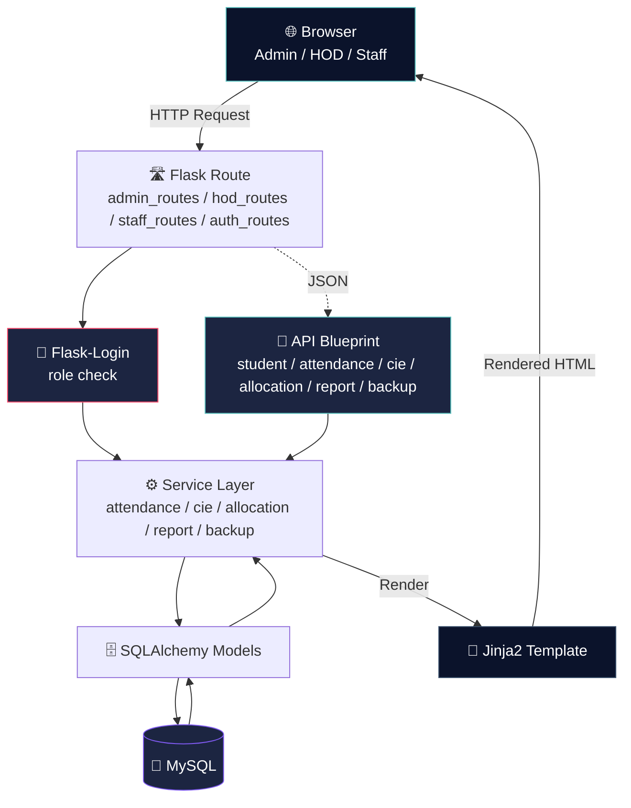

<div align="center">


<br/><br/>

<p>
  
  
  
  
  
</p>

<p>
  
  
  
</p>

<h3>🎓 A role-based college management system for attendance, internal assessments (CIE), staff allocation, and reporting</h3>

</div>

---

## 📖 Overview

The **College Management System (CMS)** is a Flask web application that automates day-to-day academic administration: attendance tracking, **CIE (Continuous Internal Evaluation)** marks, staff-to-subject allocation, student records, and database backup/restore — all behind role-based authentication for **Admin**, **HOD**, and **Staff** users.

<table align="center">
<tr>
<td align="center">🏗️<br/><b>Architecture</b><br/>Flask Blueprints (Route → Service → SQLAlchemy Model)</td>
<td align="center">🔐<br/><b>Auth</b><br/>Flask-Login, role-gated routes</td>
<td align="center">🗄️<br/><b>Data Layer</b><br/>SQLAlchemy + Flask-Migrate</td>
<td align="center">📄<br/><b>Reports</b><br/>PDF (reportlab/fpdf2) & Excel (pandas/openpyxl)</td>
</tr>
</table>

## ✨ Features

<table align="center" width="100%">
<tr>
<td width="25%" valign="top">

### 👤 Access Control
- Role-based login (Admin / HOD / Staff)
- Secure session auth (Flask-Login)
- User & role management

</td>
<td width="25%" valign="top">

### 📝 Attendance & CIE
- Attendance marking & tracking
- CIE paper & marks management
- CIE configuration per subject

</td>
<td width="25%" valign="top">

### 📚 Academics
- Student, batch, branch & class records
- Subject management
- Staff allocation to subjects/classes

</td>
<td width="25%" valign="top">

### 📊 Reports & Data
- PDF & Excel report generation
- Database backup & restore (.xlsx)
- Bulk student upload templates

</td>
</tr>
</table>

## 🛠️ Technology Stack

<div align="center">


</div>

| Layer | Technology |
|---|---|
| **Backend** | Python, Flask, Flask-SQLAlchemy, Flask-Migrate, Flask-Login |
| **Database** | MySQL (via PyMySQL) |
| **Reports** | reportlab, fpdf2, pandas, openpyxl |
| **Security** | cryptography, python-dotenv |
| **Frontend** | HTML5, CSS3, JavaScript (Jinja2 templates) |

## 🏗️ Architecture & Workflow



**Request flow:** page routes (`admin_routes`, `hod_routes`, `staff_routes`, `auth_routes`) render server-side templates, while a parallel set of API blueprints (`student_api`, `attendance_api`, `cie_api`, `allocation_api`, `report_api`, `backup_api`) handle data operations. Both paths go through the same service layer down to SQLAlchemy models backed by MySQL.

## 📂 Domain Model

Core models: `User`, `Role`, `Student`, `Batch`, `Branch`, `ClassModel`, `Subjects`, `StaffAllocation`, `Attendance`, `CieConfig`, `CieMarks`, `CiePapers`, `BackupLog`, `Setting`, `Control`, `Maintain`.

## 📸 Screenshots & Demo

> 🖼️ Add your actual screenshots to `docs/screenshots/` and update the filenames below.

<div align="center">
<table>
<tr>
<td align="center" width="50%">

<br/><b>Admin Dashboard</b>
</td>
<td align="center" width="50%">

<br/><b>Attendance Management</b>
</td>
</tr>
<tr>
<td align="center" width="50%">

<br/><b>CIE Marks Entry</b>
</td>
<td align="center" width="50%">

<br/><b>Report Generation</b>
</td>
</tr>
</table>
</div>

## 🚀 Installation

**1. Clone the repository**
```bash
git clone https://github.com/Nesara29/CMS.git
cd CMS
```

**2. Create a virtual environment & install dependencies**
```bash
python -m venv venv
venv\Scripts\activate      # Windows
source venv/bin/activate   # macOS/Linux
pip install -r requirements.txt
```

**3. Configure the database**

Set your MySQL connection string and secret keys in `config/config.py` or a `.env` file (loaded via `python-dotenv`).

**4. Run database migrations**
```bash
flask db upgrade
```

**5. Run the application**
```bash
python app.py
```

**6. Open your browser**
```
http://127.0.0.1:5000
```

## 📂 Project Structure

```
CMS/
├── app.py
├── wsgi.py
├── extensions.py
├── config/
│   └── config.py
├── models/                 → student, staff_allocation, attendance, cie_marks,
│                              cie_papers, cie_config, batch, branch, subjects,
│                              class_model, role, user, backup_log, setting, control
├── routes/                 → admin_routes, hod_routes, staff_routes, auth_routes
├── api/                    → student_api, attendance_api, cie_api,
│                              allocation_api, report_api, backup_api
├── services/                → attendance_service, cie_service, allocation_service,
│                              report_service, backup_service, auth_service
├── utils/                  → decorators, file_handler, pdf_generator,
│                              password_utils, seed_data
├── templates/               → admin.html, hod.html, staff.html, login.html,
│                              manage_users.html, report_pdf.html
├── migrations/              → Alembic migration scripts
├── backups/                 → generated .xlsx database backups
├── uploads/cie_papers/       → uploaded CIE paper files
├── logs/app.log
├── requirements.txt
└── README.md
```

## 🎯 Learning Outcomes

🐍 Python & Flask &nbsp;•&nbsp; 🗄️ SQLAlchemy ORM & Alembic migrations &nbsp;•&nbsp; 🔐 Flask-Login role-based access &nbsp;•&nbsp; 📄 PDF generation (reportlab/fpdf2) &nbsp;•&nbsp; 📊 Excel import/export (pandas/openpyxl) &nbsp;•&nbsp; 🐬 MySQL relational design &nbsp;•&nbsp; 🔌 Blueprint-based API design &nbsp;•&nbsp; 🔒 Data encryption with `cryptography`

## 📈 Future Enhancements

<table align="center">
<tr>
<td>🌐 Online Student Portal</td>
<td>👪 Parent Portal</td>
<td>💳 Fee Management System</td>
</tr>
<tr>
<td>🗓️ Timetable Management</td>
<td>📝 Examination Management</td>
<td>📧 Email & SMS Notifications</td>
</tr>
<tr>
<td>🔑 Finer-Grained Role Permissions</td>
<td>📱 Mobile Application Support</td>
<td>☁️ Cloud Deployment</td>
</tr>
</table>

## 🤝 Contributing

Contributions are welcome!

1. Fork the repository.
2. Create a new feature branch.
3. Commit your changes.
4. Push your branch.
5. Submit a Pull Request.

## 👨‍💻 Developer

<div align="center">

| | |
|---|---|
| 🧑‍💻 **Name** | `NESARA` |
| 🐙 **GitHub** | https://github.com/Nesara29 |

</div>

## 🔗 Project Links

<div align="center">

<a href="https://github.com/Nesara29/CMS">
  
</a>
<a href="https://github.com/Nesara29/CMS/issues">
  
</a>
<a href="https://github.com/Nesara29/CMS/fork">
  
</a>

</div>

## 📄 License

This project is licensed for **educational and learning purposes**. You are free to use and modify it for academic or personal projects.

## ⭐ Support

If you found this project useful, please give it a **⭐ Star** on GitHub.


</div>

